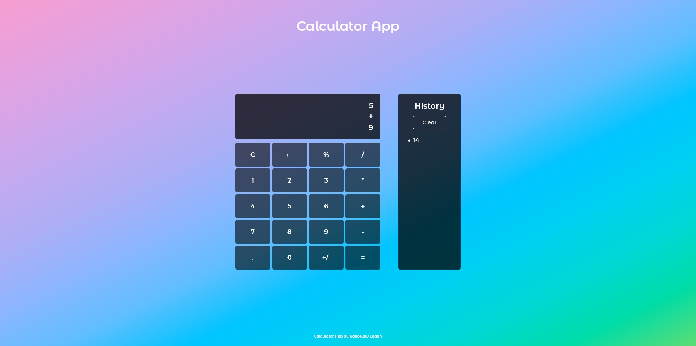

# Calculator App

This is a Calculator App that I've coded in Vanilla JavaScript.

It has basic calculator functionalities like: addition, substraction, multiplication, division and percentage calculation. It also stores a history of results that You can later click on to use them in next operations.

Calculator is my only project that is not made with Mobile First and RWD approach. Maybe I will update it one day. :)

## Overview

### The challenge

### Screenshot

### Links

- Live Site URL: [HERE](https://radoslawlagan.github.io/Calculator-app/)

## My process

### Built with

- HTML5
- CSS
- Flexbox
- CSS Grid
- JS
